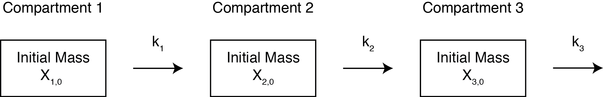

# Pharmacokinetic Data Modeling and Visualization Tool

Pharmacokinetics is the study of drug absorption, distribution, metabolism, and excretion over time. We often want to apply pharmacokinetic principles to the safe and effective therapeutic management of drugs in patients, but it may be difficult to measure drug concentrations in specific tissues. While we can easily measure drug concentrations in places like blood, urine, saliva, it can be much harder or impossible to measure drug concentrations in other tissues like in the subcutaneous space. However, easily obtained measurements can be leveraged to develop pharmacokinetic models to predict drug concentrations in other tissues where we cannot feasibly collect data from. Compartment models can be generated by dividing the body into compartments that describe the absorption, distribution and elimination. Pharmacokinetic models can be extremely valuable to drug research and development, shedding light to how a drug candidate interacts with the target organism.

## Introduction
This application is designed to aid researchers who are currently developing and researching drugs for deployment in animal models or other subjects. This tool consists of two parts that operate entirely independently, although both can be used at the same time. 

- [Part 1](#part-1) is the **Pharmacokinetic Data Modeling Calculator and Visualizer** ...and
- [Part 2](#part-2) is the **k-value Calculator**

#### Python Files and Jupyter Notebook
It should also be noted that supporting files for this application including a commented version of the Python code in this web application and a sample Jupyter Notebook for download that mimics the functionality of this application (allowing for greater end-user customizability) is available [here.](https://github.com/peytoncchen/PK-Py)

### Table of Contents
- [Installation](#installation)
- [Compartment Model Example](#compartment-model-example)
- [Part 1](#part-1)
- [Part 2](#part-2)

### Installation
This application can be run in multiple ways.

#### Github Pages
- Navigate over to the [Github Page](https://peytoncchen.github.io/PK-Visualization/) for this repository where the latest version is deployed.

#### Supramolecular Biomaterials
- This calculator was developed under the mentorship and guidance of members in the Stanford Appel Lab. There will soon be a version of this calculator deployed on the website.

#### Downloading the repository
- Clone the project:
```
git clone https://github.com/peytoncchen/PK-Visualization
```
- Or: download the source code into a zip file from the green button labelled 'Code'
- Click on ```index.html``` and the application will run in your default browser.

### Compartment Model Example

This compartment model will be utilized as an example when explaining the features of the application below.
Each compartment starts with an initial mass and with the exception of the first compartment, have flow in and out of the compartment. The flow is dictated by the rates labeled as k<sub>1</sub>, k<sub>2</sub>, and k<sub>3</sub> in this example picture. Your model may have more or less compartments.


### Part 1
The Pharmacokinetic Data Modeling Calculator and Visualizer allows users to set up a system of ordinary differential equations (ODEs) describing a simple compartment model and then solve and plot the analyte profiles in each compartment over time. 

### Part 2


### Built With
- HTML/CSS/JS
- pyodide (which allowed us to run Python in the browser) and the Python packages scipy and numpy

### Feedback/Development
The code for this application is open source and can be downloaded and modified as you wish.

### Licensing
This application is licensed under the MIT License. See [LICENSE.txt](LICENSE.txt) for more details.

### Developers
- Peyton Chen

### Acknowledgments
- Caitlin Maikawa, Stanford Bioengineering Ph.D.
- Joseph Mann, Stanford Materials Science Ph.D.

- Eric Appel, Assistant Professor of Materials Science and Engineering at Stanford University