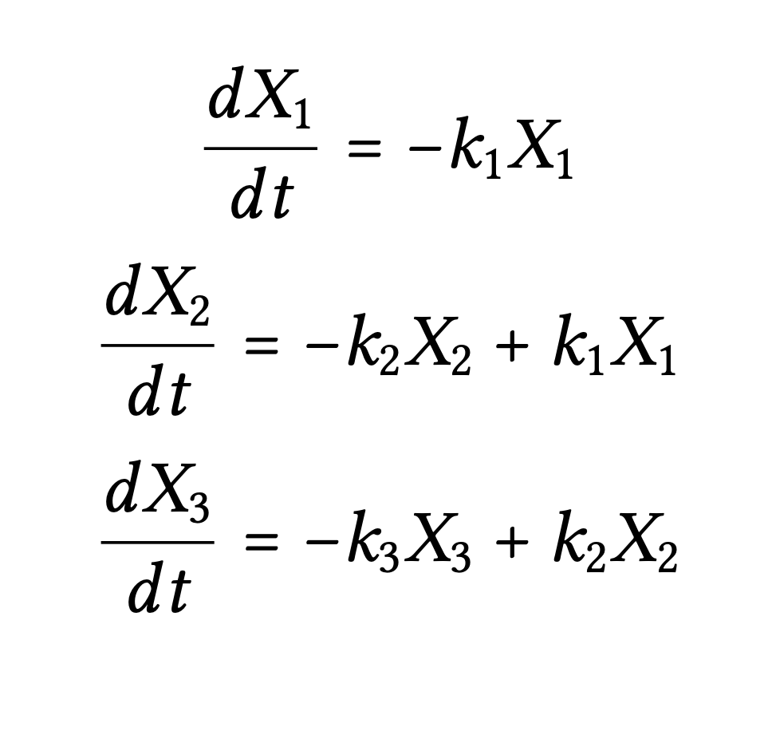

# Pharmacokinetic Data Modeling and Visualization Tool

Pharmacokinetics is the study of drug absorption, distribution, metabolism, and excretion over time. We often want to apply pharmacokinetic principles to the safe and effective therapeutic management of drugs in patients, but it may be difficult to measure drug concentrations in specific tissues. While we can easily measure drug concentrations in places like blood, urine, saliva, it can be much harder or impossible to measure drug concentrations in other tissues like in the subcutaneous space. However, easily obtained measurements can be leveraged to develop pharmacokinetic models to predict drug concentrations in other tissues where we cannot feasibly collect data from. Compartment models can be generated by dividing the body into compartments that describe the absorption, distribution and elimination. Pharmacokinetic models can be extremely valuable to drug research and development, shedding light to how a drug candidate interacts with the target organism.

## Introduction
This application is designed to aid researchers who are currently developing and researching drugs for deployment in animal models or other subjects. This tool consists of two parts that operate entirely independently, although both can be used at the same time.

**Note:** you will notice some stutters as packages load in. This is completely normal. Additionally, the **Calculate k-values** button in part 2 is grayed out until said packages load - this can take up to 30 seconds.

- [Part 1](#part-1) is the **Pharmacokinetic Data Modeling Calculator and Visualizer** ...and
- [Part 2](#part-2) is the **k-value Calculator**

#### Python Files and Jupyter Notebook
It should also be noted that supporting files for this application including a commented version of the Python code in this web application and a sample Jupyter Notebook for download that mimics the functionality of this application (allowing for greater end-user customizability) is available [here.](https://github.com/peytoncchen/PK-Py)

## Table of Contents
- [Installation](#installation)
- [Compartment Model Example](#compartment-model-and-differential-equations-example)
- [Part 1](#part-1)
- [Part 2](#part-2)
- [Methodologies](#methodologies)

## Installation
This application can be run in multiple ways.

### Github Pages
- Navigate over to the [Github Page](https://peytoncchen.github.io/PK-Visualization/) for this repository where the latest version is deployed.

### Supramolecular Biomaterials
- This calculator was developed under the mentorship and guidance of members in the Stanford Appel Lab. There will soon be a version of this calculator deployed on the website.

### Downloading the repository
- Clone the project:
```
git clone https://github.com/peytoncchen/PK-Visualization
```
- Or: download the source code into a zip file from the green button labelled 'Code'
- Click on ```index.html``` and the application will run in your default browser.

## Compartment Model and Differential Equations Example
<p align="center">

</p>
This compartment model will be utilized as an example when explaining the features of the application below.
Each compartment starts with an initial mass and with the exception of the first compartment, have flow in and out of the compartment. The flow is dictated by the rates labeled as k<sub>1</sub>, k<sub>2</sub>, and k<sub>3</sub> in this example picture. Your model may have more or less compartments.

The differential equations used in the calculator, resemble the following, where each compartment's derivative is modified by the incoming mass and outgoing mass, where *X* represents the mass of a compartment.
<p align="center">

</p>


## Part 1
<p align="center">

</p>
The Pharmacokinetic Data Modeling Calculator and Visualizer allows users to set up a system of ordinary differential equations (ODEs) describing a simple compartment model and then solve and plot the analyte profiles in each compartment over time. 

### Inputs:
- **Number of Compartments:**
    - The number of compartments you have in your model. The compartment model example above has 3 (three) compartments.
- **Compartment info:**
    - For each compartment, you will have the option to name it (this will show up in the downloaded CSV), and be prompted to enter intial values and k-values. The k-value input field in row 1 represents the k-value from Compartment 1 to 2 (k<sub>1</sub> in the compartment model example), k-value in row 2 represents the k-value from Compartment 2 to 3 (k<sub>2</sub> in the compartment model example) and so on.
- **Time range and units:**
    - Specify 0 to what time you would like to generate data from and the associated units. Default is 250 minutes.
- **Number of steps:**
    - Specify the number of steps that you would like the integrator to take. Default is 100,000. **Warning:** too many steps will result in a lot of RAM usage and may take a long time.
- **Mass or concentration:**
    - Specify whether you want the y-values generated to be in mass or concentration. If concentration, another row will appear called the "Animal Model Constant" prompting you to fill out a constant and select which compartments you want it to affect. You are allowed to put in mathematical expressions or numbers here.

Finally, you can press the **Calculate & Graph** button which will calculate and store all the results as well as graph it. By clicking on the legend, you are able to enable and disable plotting of different compartments' datasets. If anything failed, it will display an error. This means that either your inputs were not of the correct type or they were impossible. Note, large k-values are known to cause errors as we are using a 4th order Runge-Kutta ODE solver. See [methodologies](#methodologies) for more information.

The download field will also enable at this point. You can input a filename (default is export) and select which compartment(s) you want to export to a CSV file. This file will download at your default download location. An example of what will download can be seen [here.](examples/mydata.csv)

## Part 2
<p align="center">

</p>
The k-value Calculator allows users to set up a system of ordinary differential equations (ODEs) describing a simple compartment model and input a CSV containing experimental data, then have an optimizing algorithm run to fit the data to a set of k-values. 

### Inputs:
- **Choose CSV File to upload:**
    - Clicking this field will bring up an input dialog for you to upload a CSV. Please follow the format of the CSV [here](examples/myinput.csv). Essentially, you will want the first row to be headers, your first column to be time, and your second column to be the dependent variable. Any additional columns are not supported currently and will produce errors. Please ensure that you delete any data that you do not want to consider any entry (time, value) that is missing either value will just result in the entire row being ignored.
- **Number of Compartments, Mass or Concentration, Animal Model Constant**
    - Same as part 1
- **CSV data represents**
    - Please input what compartment your CSV data represents. In the example case, our data represented Compartment 3.
- **Compartment Info**
    - Please indicate the bounds for k-values that you are unsure of and the initial value that the compartment starts off at. If you do know the value, please tick the "Constrain" box and fill in what the k-value is for that compartment. 

Finally, you can press the **Calculate k-values** which will parse your inputs and return final k-value results for each compartment. For specifics as to how this is done check-out the Python files which the code from this app is based on and the [methodologies](#methodologies) section below. There is also an example Jupyter Notebook that can be customized to your specific situation. The link to that repository is [here.](https://github.com/peytoncchen/PK-Py)

## Methodologies
Below is a quick summary of the math that runs behind the scenes.
### Ordinary Differential Equation (ODE) solver
We have adapted a module from Ricky Reusser (2015) for use in this web application. The code integrates a system of ODEs using the Fourth Order Runge-Kutta method. More information as well as formulas that the code is based on can be viewed [here.](https://github.com/scijs/ode-rk4)

### Optimization Algorithm and set-up
For commented Python code (and a customizable Jupyter Notebook!), visit [here.](https://github.com/peytoncchen/PK-Py/blob/master/calc_k.py)
Apart from retrieving and parsing the inputs, the core of the algorithm is handed over to pyodide and Python code to deliver the final result. First, the CSV data array is converted into a dictionary that we can manipulate with time as the keys. That dictionary is then matched to a fit dictionary that is normalized. Then, the sum of squared errors (SSE) between the two dictionaries are minimized through scipy's optimize.brute function, which returns an array one for each compartment in your model.


## Built With
- HTML/CSS/JS
- pyodide (which allowed us to run Python in the browser) and the Python packages scipy and numpy (go WebAssembly!)

## Feedback/Development
The code for this application is open source and can be downloaded and modified as you wish.

## Licensing
This application is licensed under the MIT License. See [LICENSE.txt](LICENSE.txt) for more details.

## Developers
- Peyton Chen

## Acknowledgments
- Caitlin Maikawa, Stanford Bioengineering Ph.D.
- Joseph Mann, Stanford Materials Science Ph.D.
- Eric Appel, Assistant Professor of Materials Science and Engineering at Stanford University